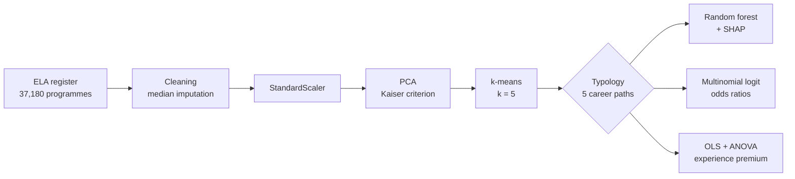

# Career Paths of Polish Graduates

A cluster-then-predict analysis of 37,180 study programmes using the Polish national graduate tracking register (ELA).


Master's thesis, Faculty of Management and Economics, Gdańsk University of Technology.

## What this project does

Public reporting on graduate outcomes in Poland tends to rank study programmes along a single axis running from worse to better. This project asks whether that axis is the right shape. It applies unsupervised learning to the full register rather than a survey sample, lets the typology emerge from the data, and only then asks how much of it can be predicted from characteristics known before graduates enter the labour market.

The answer is that a single axis is not enough. Five qualitatively distinct paths emerge, and two of them cut across the dominant success-failure split, organised around employment form rather than income level.

## Data

The analysis uses the Economic Outcomes of Graduates system (Ekonomiczne Losy Absolwentów, ELA), which links the POL-on higher education register with social insurance records held by ZUS.

| | |
|---|---|
| Unit of analysis | Study programme (field × institution), not the individual graduate |
| Observations | 37,180 programmes across 463 institutions and 8 academic fields |
| Diploma cohorts | 2014 to 2023 |
| Follow-up | Up to five years after graduation (P1 to P5) |
| Features | 43 outcome indicators: relative earnings, relative unemployment, contract type, self-employment, time to first job, continued education |

**The source data is not included in this repository.** It is published by OPI PIB and subject to its own terms of use. Download it from [ela.nauka.gov.pl](https://ela.nauka.gov.pl) and place `graduates-major-data.csv` in the project root before running the notebooks.

## Method



The unsupervised stage reduces the feature space by principal component analysis, retaining components above the Kaiser criterion, and partitions programmes with k-means. The choice of k = 5 departs from what internal validity metrics recommend; the reasoning is set out in the thesis and rests on the continuum structure visible in t-SNE and UMAP projections, the absence of a natural cut in the Ward dendrogram, and a nesting analysis showing that two clusters cross the dominant dichotomy. Ward linkage and a Gaussian mixture model serve as triangulation, and Isolation Forest flags outliers without removing them.

The supervised stage treats cluster membership as the target and uses only structural predictors known before labour market entry, which keeps the two stages separate and avoids circularity.

## Key results

Five career paths, none of which is simply a rung on one ladder:

| Path | N | Share | Defining profile |
|---|---:|---:|---|
| Stable salaried employment | 11,649 | 31.3% | Elevated probability of an employment contract, earnings slightly above average |
| Average, unemployment risk | 9,969 | 26.8% | Closest to the population mean, with raised relative unemployment |
| Difficult start | 8,265 | 22.2% | Longest time to first job, highest rate of continued study |
| Self-employment (B2B) | 4,444 | 12.0% | Highest self-employment, low salaried share, earnings dispersed |
| Earnings elite | 2,853 | 7.7% | Relative earnings z-score of +1.9 to +2.2, negligible unemployment |

Predictability of path membership from structural features alone:

| Model | Balanced accuracy | Macro F1 |
|---|---:|---:|
| Random classifier | 0.20 | 0.20 |
| Multinomial logit | 0.431 | 0.343 |
| Random forest | 0.537 | 0.495 |

Institution matters beyond field of study. Academic field alone explains 16.9% of the variance in the success index; adding institutional identity raises this to 29.6%, while region adds a further 0.1 percentage points.

## Repository structure

```
.
├── notebooks/
│   ├── 01_clustering.ipynb      # PCA, k-means, triangulation, profiling
│   └── 02_classification.ipynb  # Random forest, SHAP, logit, OLS
├── requirements.txt
├── .gitignore
└── README.md
```

## Citation

If you use this code, please cite the thesis:

> Ostrowski, N. (2026). *Analysis of graduates' careers using unsupervised learning and hybrid models*. Master's thesis, Gdańsk University of Technology, Faculty of Management and Economics.

## License

MIT. See [LICENSE](LICENSE).
